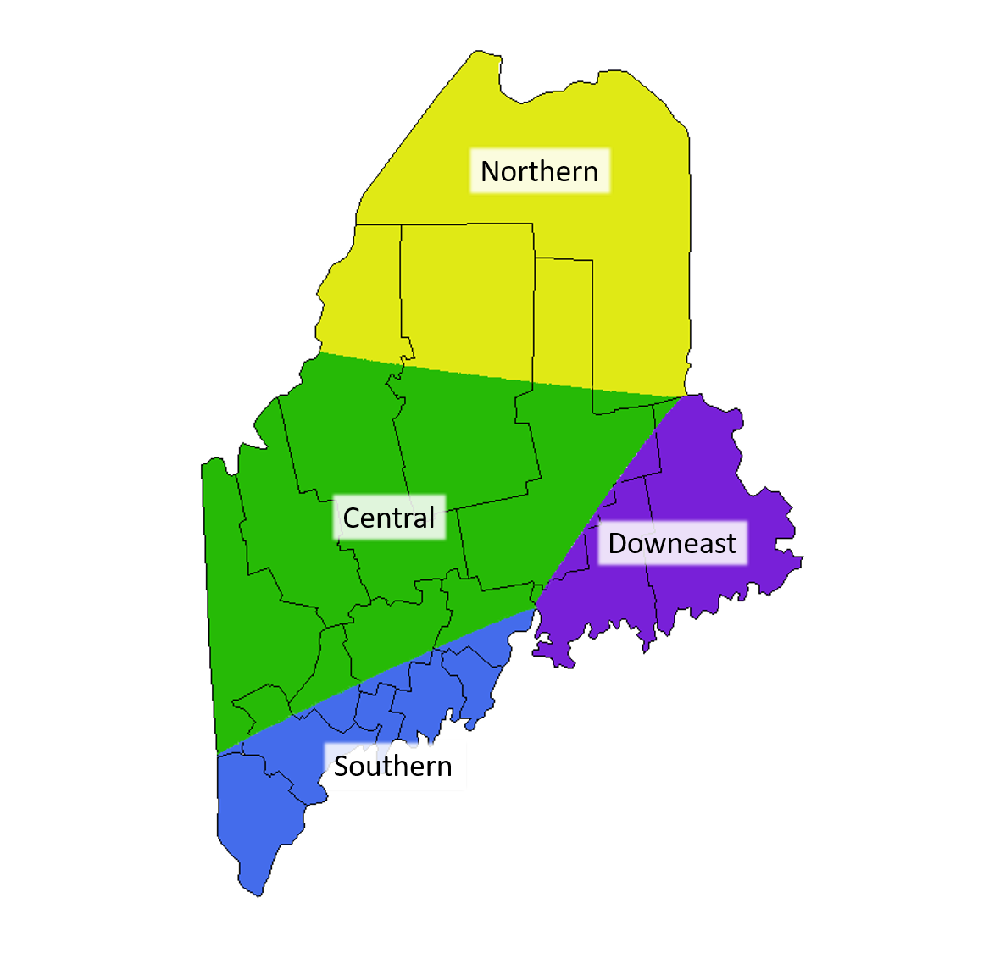

```{r, include = FALSE}
whatprices <- if(params$organic == "All"){"both Organic and Conventional products"} else if(params$organic== "Organic"){"only Organic products" } else {"only  products not identified as USDA Organic"}
whichmarkets <- if(params$marketselect == "State Average"){"State Average"} else {str_c("the",params$marketselect,"region", sep = " ")}
whichmonth <- params$month
monthlabel <- params$monthlist %>% filter(year == params$year & month == params$month)
```


<center>
{width=55%}
</center>

\

# This report was generated on `r Sys.Date()`. 

\

## The report includes `r whichmarkets` prices including `r whatprices` for the month of `r paste(monthlabel[1,3],monthlabel[1,1],sep = " ")`.  


\

```{r, echo = FALSE, message=FALSE,warning=FALSE}
# Set up data
  reporttabledata  <- params$datafull %>% 
              filter(marketregion == params$marketselect &
                          year == params$year &
                          organic == params$organic &
                          month == params$month) %>% 
              rename(`Month` = thismonth,
                      Region = marketregion,
                     `Price Group` = organic,
                     `Avg. Price`= price,
                     `Min` = min,
                     `Max` = max,
                     `Number Reporting` = num.reporting,
                     Product= product) %>% 
              select(-product.num, -month,-year)

# Make Table
  reporttable <- reporttabledata %>% 
    gt() %>% 
        opt_row_striping(row_striping = TRUE) %>% 
        tab_source_note(source_note = "(S) indicates that data supressed due to fewer than three reported prices." ) %>%
        tab_source_note(source_note = "(.) indicates no data available.") 

    reporttable
```

---

<center>
{width="100%"}
<center>

This report is made possible with funding through the Maine Department of Agriculture, Conservation, and Forestry and the support of the Maine Federation of Farmers Markets, Maine Organic Farmers and Gardeners Association, and the Maine Agricultural and Forest Experiment Station at University of Maine.

\

This work is also supported by the Hatch Act, project award no. 5501357, from the U.S. Department of Agriculture's National Institute of Food and Agriculture. Any opinions, findings, conclusions, or recommendations expressed in this publication are those of the author(s) and should not be construed to represent any official USDA or U.S. Government determination or policy.

\

\

\

